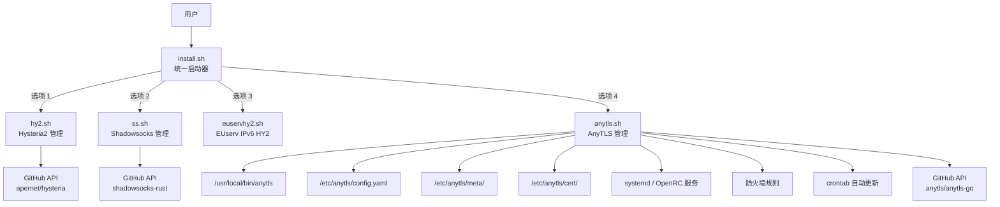
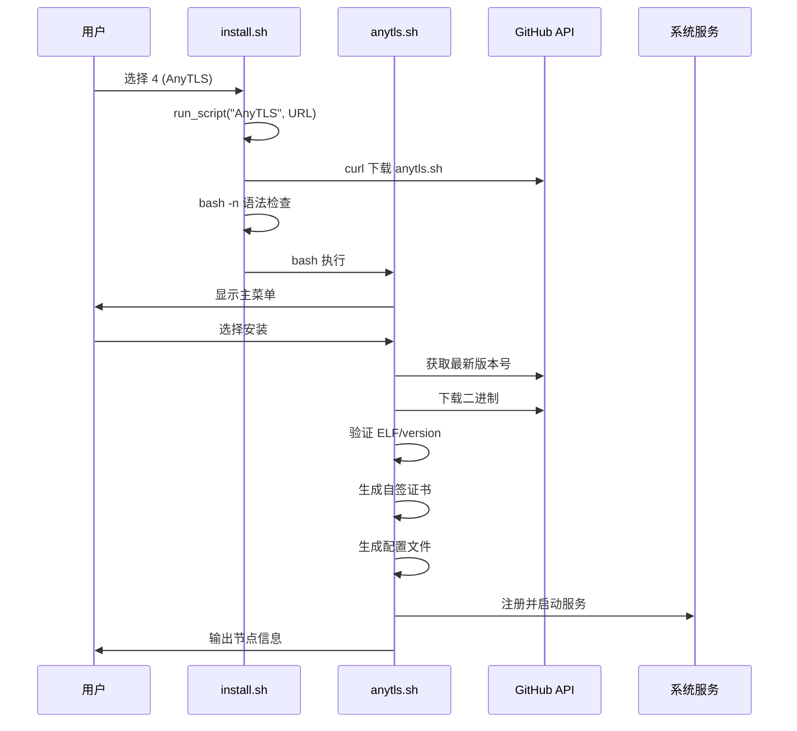

# Design Document

## Overview

本设计文档覆盖两大工作：

1. **Bug 修复与优化**：对现有 `hy2.sh`、`ss.sh`、`euservhy2.sh`、`install.sh` 进行健壮性、兼容性和防火墙管理方面的改进
2. **AnyTLS 协议支持**：新增 `anytls.sh` 管理脚本并集成到 `install.sh` 启动器

AnyTLS 是一种基于 TCP 的 TLS 代理协议，通过模拟真实 TLS 会话行为来规避"TLS in TLS"指纹检测。服务端二进制来自 [github.com/anytls/anytls-go](https://github.com/anytls/anytls-go)，客户端支持 Clash Meta (mihomo) 和 Shadowrocket。

### 设计原则

- 遵循 `docs/ARCHITECTURE.md` 脚本模板，保持零依赖、全独立的设计
- 所有改动必须通过 `tests/validate_scripts.sh` 静态验证
- 不引入 bash 4.x+ 独有语法，确保 busybox/Alpine 兼容
- 下载函数使用 `return 1` 而非 `exit 1`，由调用方决定回滚或终止
- 升级必备份（`.bak`），失败必回滚

## Architecture

### 系统架构图


### 执行流程



### 目录结构（新增文件）

```
hy2/
├── anytls.sh              # 新增：AnyTLS 管理脚本
├── install.sh             # 修改：新增 AnyTLS 菜单项
├── hy2.sh                 # 修改：Bug 修复与优化
├── ss.sh                  # 修改：Bug 修复与优化
├── euservhy2.sh           # 修改：Bug 修复与优化
└── tests/
    └── validate_scripts.sh # 修改：新增 anytls.sh 验证
```

### VPS 安装产物

| 组件 | 路径 |
|------|------|
| AnyTLS 二进制 | `/usr/local/bin/anytls` |
| AnyTLS 配置 | `/etc/anytls/config.yaml` |
| AnyTLS 元数据 | `/etc/anytls/meta/` |
| AnyTLS 证书 | `/etc/anytls/cert/` |
| systemd 服务 | `/etc/systemd/system/anytls-server.service` |
| OpenRC 服务 | `/etc/init.d/anytls-server` |
| 自动更新脚本 | `/usr/local/bin/anytls-autoupdate.sh` |
| 自动更新日志 | `/var/log/anytls-autoupdate.log` |

## Components and Interfaces

### 1. anytls.sh 核心函数清单

遵循 `docs/ARCHITECTURE.md` 模板的必须实现函数：

| 函数名 | 职责 | 对应需求 |
|--------|------|----------|
| `check_root()` | 检查 root 权限 | R12 |
| `detect_init()` | 检测 systemd/OpenRC | R2.5 |
| `detect_network()` | IPv4/IPv6/NAT 检测（含 WARP 过滤） | R3 |
| `install_dependencies()` | 按发行版安装依赖 | R2 |
| `get_latest_version()` | 从 GitHub API 获取最新 release | R6.1 |
| `download_anytls()` | 下载二进制（双源 fallback, return 1） | R1.1, R6.1 |
| `validate_binary()` | ELF magic / version 子命令验证 | R4.2, R6.3 |
| `install_anytls()` | 完整安装流程 | R6 |
| `upgrade_anytls()` | 升级（含备份回滚） | R6.5 |
| `uninstall_anytls()` | 卸载清理 | R6.6 |
| `service_start/stop/restart` | 按 INIT_SYS 分发服务操作 | R2.5 |
| `service_is_active()` | 检测服务运行状态 | R1.2 |
| `gen_config()` | 生成 AnyTLS 配置文件 | R7 |
| `gen_cert()` | 生成自签 TLS 证书 | R7.2 |
| `show_config()` | 展示节点信息与分享链接 | R8 |
| `change_port()` | 修改端口（awk 块检测 + 备份回滚） | R7.3 |
| `change_password()` | 修改密码 | R7.3 |
| `change_sni()` | 修改 SNI | R7.3 |
| `open_firewall_port()` | 防火墙单端口放行 | R5 |
| `close_firewall_port()` | 防火墙规则移除 | R5.4 |
| `enable_bbr()` | BBR 加速 | R11.1 |
| `setup_autoupdate()` | 自动更新 cron | R11.3 |
| `remove_autoupdate()` | 移除自动更新 | R11.7 |
| `server_tools_menu()` | 服务器工具子菜单 | R11.6 |
| `main_menu()` | 主菜单循环 | R6.7 |

### 2. install.sh 修改接口

```bash
# 新增常量
ANYTLS_URL="${BASE_URL}/anytls.sh"

# get_status() 中新增 AnyTLS 状态检测
# main_menu() 中新增选项 4
# 输入范围 [0-4]
```

### 3. 防火墙层接口（所有脚本共享逻辑）

```bash
# 幂等添加规则
open_firewall_port() {
    local port="$1" proto="$2"  # proto: tcp/udp/both
    # 检测 ufw → firewalld → iptables 优先级
    # iptables: -C 先检查再 -A
    # 双栈: 同时操作 iptables + ip6tables
    # 持久化: iptables-save / netfilter-persistent
}

# 端口范围放行（Hysteria 端口跳跃）
open_firewall_range() {
    local start="$1" end="$2" proto="$3"
}

# 规则移除
close_firewall_port() {
    local port="$1" proto="$2"
}
```

### 4. 备份回滚器接口

```bash
# 升级前备份
backup_binary() {
    cp "$BIN" "${BIN}.bak" || { echo "备份失败"; return 1; }
}

# 服务启动失败时回滚
rollback_binary() {
    cp "${BIN}.bak" "$BIN" && chmod +x "$BIN"
    service_restart
    echo -e "${YELLOW}已回滚到旧版本${PLAIN}"
}
```

### 5. 输入验证接口

```bash
# 端口验证
validate_port() {
    local port="$1"
    # 纯数字 1-65535 且未被占用
}

# 密码验证
validate_password() {
    local pw="$1"
    # 1-128 字符，不含 " \ $ ` 和控制字符
}

# 域名格式验证
validate_domain() {
    local domain="$1"
    # 仅字母数字点号连字符，无协议前缀/端口号
}
```

### 6. 网络检测器接口（优化后）

```bash
detect_network() {
    # IPv4: 3 个 API 依次尝试（connect-timeout 3, max-time 6）
    # IPv6: 2 个 API 依次尝试（max-time 6）
    # WARP/tunnel 网卡过滤: wgcf|warp|tun*|wg*|tailscale|zt*
    # fe80 链路本地排除
    # NAT 判断: 公网 IP 不在本机接口列表中
    # 回退: 本机 global scope 地址 + 用户确认警告
}
```

## Data Models

### AnyTLS 配置文件格式 (`/etc/anytls/config.yaml`)

```yaml
listen: ":443"
password: "generated-or-user-specified"
tls:
  cert: "/etc/anytls/cert/cert.pem"
  key: "/etc/anytls/cert/key.pem"
  sni: "bing.com"
```

### AnyTLS 元数据目录 (`/etc/anytls/meta/`)

| 文件 | 内容 | 用途 |
|------|------|------|
| `listen_port` | 监听端口号 | 内网端口 |
| `ext_port` | 外网映射端口 | NAT 模式用 |
| `password` | 密码明文 | show_config 读取 |
| `sni` | SNI 域名 | show_config 读取 |
| `version` | 当前安装版本 | 状态显示 |

### systemd 服务文件模板

```ini
[Unit]
Description=AnyTLS Server
After=network.target

[Service]
Type=simple
User=root
ExecStart=/usr/local/bin/anytls server -c /etc/anytls/config.yaml
Restart=on-failure
RestartSec=5s
LimitNOFILE=1048576

[Install]
WantedBy=multi-user.target
```

### OpenRC 服务脚本模板

```bash
#!/sbin/openrc-run
name="anytls-server"
description="AnyTLS Server"
command="/usr/local/bin/anytls"
command_args="server -c /etc/anytls/config.yaml"
command_background=true
pidfile="/var/run/anytls.pid"
output_log="/var/log/anytls.log"
error_log="/var/log/anytls.log"

depend() {
    need net
    after firewall
}
```

### 自动更新脚本模板（heredoc 生成）

```bash
#!/bin/bash
LOG="/var/log/anytls-autoupdate.log"
BIN="/usr/local/bin/anytls"
ts() { date '+%Y-%m-%d %H:%M:%S'; }

echo "[$(ts)] 开始版本检查" >> "$LOG"
# ... 获取最新版本、比较、下载、备份、替换、重启、验证
# 任何步骤失败则从 .bak 恢复并记录日志
```

### Clash Meta (mihomo) 客户端配置片段

```yaml
proxies:
  - name: "AnyTLS-节点名"
    type: anytls
    server: <PUBLIC_IP>
    port: <EXT_PORT>
    password: "<password>"
    sni: "<sni>"
    skip-cert-verify: true
```

### Shadowrocket 导入链接格式

由于 AnyTLS 目前尚无标准化 URI scheme，采用与 Trojan 类似的格式：

```
anytls://<password>@<server>:<port>?sni=<sni>&allowInsecure=1#<节点名>
```

> 注：若 Shadowrocket 未来支持原生 AnyTLS URI，需相应更新格式。

### install.sh 状态检测逻辑

```bash
# AnyTLS 状态
if [ -f "/usr/local/bin/anytls" ]; then
    _ver=$(/usr/local/bin/anytls version 2>/dev/null | grep -oE 'v[0-9]+\.[0-9]+\.[0-9]+' | head -1)
    if service_active anytls-server /var/run/anytls.pid; then
        ANYTLS_STATUS="${GREEN}● 运行中${PLAIN}${DIM} ${_ver}${PLAIN}"
    else
        ANYTLS_STATUS="${YELLOW}● 已停止${PLAIN}${DIM} ${_ver}${PLAIN}"
    fi
else
    ANYTLS_STATUS="${RED}● 未安装${PLAIN}"
fi
```

## Correctness Properties

*A property is a characteristic or behavior that should hold true across all valid executions of a system—essentially, a formal statement about what the system should do. Properties serve as the bridge between human-readable specifications and machine-verifiable correctness guarantees.*

### Property 1: 端口验证正确性

*For any* 字符串输入，`validate_port` 应当返回成功当且仅当该字符串是纯数字（无前导零除外的"0"本身）且其数值在 [1, 65535] 闭区间内；对于任何不满足条件的字符串（含空串、负数、浮点数、带字母、超出范围），应当返回失败。

**Validates: Requirements 1.3**

### Property 2: 密码验证正确性

*For any* 字符串输入，`validate_password` 应当返回成功当且仅当该字符串长度在 [1, 128] 范围内，且不包含双引号(`"`)、反斜杠(`\`)、美元符(`$`)、反引号(`` ` ``)或任何 ASCII 控制字符(0x00-0x1F, 0x7F)；对于任何不满足条件的字符串，应当返回失败。

**Validates: Requirements 1.4**

### Property 3: 域名格式验证正确性

*For any* 字符串输入，`validate_domain` 应当返回成功当且仅当该字符串仅由小写字母、大写字母、数字、点号(`.`)和连字符(`-`)组成，不以点号或连字符开头/结尾，不含协议前缀（如 `http://`、`https://`）且不含端口号（如 `:443`）；对于任何不满足条件的字符串，应当返回失败。

**Validates: Requirements 7.4**

### Property 4: IPv6 地址过滤正确性

*For any* `ip -6 addr show scope global` 输出，网络检测器提取的 IPv6 地址应当：(a) 不属于名称匹配 `wgcf|warp|tun*|wg*|tailscale|zt*` 的网卡，(b) 不以 `fe80` 开头，(c) 不以 `2606:4700:` 开头（Cloudflare WARP 地址段）。任何通过过滤的地址必须来自真实物理或虚拟化主网卡的 global scope 地址。

**Validates: Requirements 3.1**

### Property 5: 二进制有效性验证

*For any* 文件内容，`validate_binary` 应当判定为有效当且仅当：文件前 4 字节为 ELF magic bytes (`\x7fELF`)，或者以该文件路径执行 `version` 子命令返回退出码 0。对于任何不满足条件的文件（空文件、HTML 错误页、截断的下载），应当判定为无效。

**Validates: Requirements 4.2, 6.3**

### Property 6: YAML 配置修改隔离性

*For any* 有效的 AnyTLS 配置文件和任意单字段修改操作（修改 port、password 或 sni 中的一项），修改后的配置文件应当：(a) 目标字段更新为新值，(b) 所有非目标字段保持原始值不变，(c) 文件仍为有效的 YAML 格式。

**Validates: Requirements 7.3**

### Property 7: 分享链接包含全部必要参数

*For any* 有效的连接参数组合（server、port、password、sni），分享链接生成器输出的所有格式（Clash Meta 配置片段、Shadowrocket URI、文本摘要）中，每种格式均应包含全部四项连接参数的值。

**Validates: Requirements 8.1, 8.2, 8.3**

### Property 8: NAT 模式端口替换一致性

*For any* NAT 模式配置（NAT_MODE=1，LISTEN_PORT ≠ EXT_PORT），分享链接生成器输出的所有格式中使用的端口值应当等于 EXT_PORT（外网映射端口），而非 LISTEN_PORT（本机监听端口）。

**Validates: Requirements 3.3, 8.5**

## Error Handling

### 错误处理策略总表

| 场景 | 处理方式 | 退出行为 |
|------|----------|----------|
| 下载主源失败 | 切换备用源重试 | `return 1` 由调用方决定 |
| 备用源也失败 | 输出错误提示，保留现有二进制 | `return 1` |
| 备份 cp 失败 | 取消升级，输出错误 | `return 1` |
| 二进制验证失败 | 删除临时文件 | `return 1` |
| 服务启动失败 | 从 .bak 回滚 + 重启 | 继续运行，输出回滚提示 |
| 配置修改后重启失败 | 从备份恢复配置 + 重启 | 继续运行，提示修改未生效 |
| 端口/密码/域名输入无效 | 输出具体原因，要求重新输入 | 循环等待合法输入 |
| 防火墙工具不存在 | 输出警告，跳过防火墙配置 | 不阻断安装流程 |
| 防火墙命令执行失败 | 输出端口和协议信息，提示手动配置 | 不阻断安装流程 |
| crontab 不可用 | 尝试安装 cron 包，仍不可用则跳过 | 输出错误，继续运行 |
| 配置文件不存在 | 输出错误提示 | `return` 不输出配置 |
| 公网 IP 检测全部超时 | 回退本机 global 地址 + 警告 | 继续，需用户确认 |

### 回滚机制详细流程


### 日志格式规范（自动更新器）

```
[2026-06-11 03:00:01] 版本检查: 当前 v0.1.5，最新 v0.1.6
[2026-06-11 03:00:02] 下载: 成功 (anytls-linux-amd64)
[2026-06-11 03:00:02] 备份: /usr/local/bin/anytls → /usr/local/bin/anytls.bak
[2026-06-11 03:00:03] 替换: 完成
[2026-06-11 03:00:04] 重启: 服务已启动
[2026-06-11 03:00:07] 结果: 升级成功 v0.1.5 → v0.1.6
```

失败示例：
```
[2026-06-11 03:00:01] 版本检查: 当前 v0.1.5，最新 v0.1.6
[2026-06-11 03:00:15] 下载: 失败 (主源超时)
[2026-06-11 03:00:30] 下载: 失败 (备用源超时)
[2026-06-11 03:00:30] 结果: 升级失败，保留当前版本 v0.1.5
```

## Testing Strategy

### 测试层级

本项目为纯 bash 脚本，无编译步骤，测试分为以下层级：

#### 1. 静态验证（CI 自动执行）

通过 `tests/validate_scripts.sh` 执行，GitHub Actions 在 push/PR 时触发：

- **bash -n 语法检查**：所有脚本 + heredoc 提取内容
- **CRLF 换行符检测**：`grep -q $'\r'`
- **兼容性规则检查**：禁止 `grep -oP`、`${var,,}`、`${var^^}`、`head -c`
- **版本号一致性**：文件头、菜单、变量中版本号匹配
- **文档完整性**：必需文档文件存在且非空

#### 2. 属性测试（Property-Based Testing）

**测试框架选择**：由于项目是 bash 脚本，可以将核心验证逻辑提取为可独立调用的函数，使用 [bats-core](https://github.com/bats-core/bats-core) 作为 bash 测试框架，配合自定义随机输入生成器实现属性测试。

**配置要求**：
- 每个属性测试最少运行 100 次迭代
- 每个测试用注释标注对应的设计文档属性编号
- 标签格式：`# Feature: bugfix-optimize-anytls, Property N: <属性描述>`

**属性测试覆盖范围**：

| 属性 | 测试函数 | 输入生成策略 |
|------|----------|-------------|
| Property 1: 端口验证 | `validate_port` | 随机字符串: 合法端口(1-65535)、边界值(0,65536)、非数字、空串、超长 |
| Property 2: 密码验证 | `validate_password` | 随机字符串: 合法密码(ASCII可打印无禁止字符)、含禁止字符、空串、超长(>128) |
| Property 3: 域名验证 | `validate_domain` | 随机字符串: 合法域名、含协议前缀、含端口号、特殊字符、空串 |
| Property 4: IPv6 过滤 | `_get_real_ipv6` (awk) | 生成模拟 `ip addr` 输出: 含 WARP/tunnel 网卡、含 fe80 地址、含正常全局地址 |
| Property 5: 二进制验证 | `validate_binary` | 生成文件: 有效 ELF 头、随机垃圾数据、HTML 内容、空文件 |
| Property 6: YAML 修改隔离 | YAML 编辑逻辑 | 生成随机配置值组合，修改单个字段 |
| Property 7: 分享链接参数完整性 | `show_config` 输出 | 随机 IP/端口/密码/SNI 组合 |
| Property 8: NAT 端口替换 | `show_config` NAT 模式输出 | 随机 LISTEN_PORT ≠ EXT_PORT 对 |

#### 3. 单元测试（Example-Based）

使用 bats-core 对特定场景进行确定性测试：

- 架构映射：x86_64→amd64、aarch64→arm64、unsupported→error
- 双栈环境两组链接输出
- NAT 模式元数据文件内容正确
- 菜单选项 0-4 有效范围
- 颜色变量定义与模板一致

#### 4. 集成测试（VPS 手动执行）

在一次性 VPS 上按 `docs/TESTING.md` 测试矩阵执行：

- **环境矩阵**：Debian 12 (systemd) + Alpine 3.19 (OpenRC)
- **网络矩阵**：标准 IPv4、NAT、双栈、纯 IPv6
- **防火墙矩阵**：ufw、firewalld、iptables、无防火墙
- **流程覆盖**：
  - 全新安装 → 查看节点信息 → 升级 → 修改配置 → 卸载
  - 升级失败回滚
  - 自动更新创建/执行/移除
  - install.sh 启动器选择 AnyTLS

### 测试文件结构（新增）

```
tests/
├── validate_scripts.sh     # 修改：新增 anytls.sh
├── test_validate_port.bats # 新增：端口验证属性测试
├── test_validate_pw.bats   # 新增：密码验证属性测试
├── test_validate_domain.bats # 新增：域名验证属性测试
├── test_ipv6_filter.bats   # 新增：IPv6 过滤属性测试
├── test_binary_check.bats  # 新增：二进制验证属性测试
├── test_yaml_edit.bats     # 新增：YAML 修改属性测试
├── test_share_links.bats   # 新增：分享链接属性测试
└── helpers/
    └── generators.bash     # 新增：随机输入生成器
```
