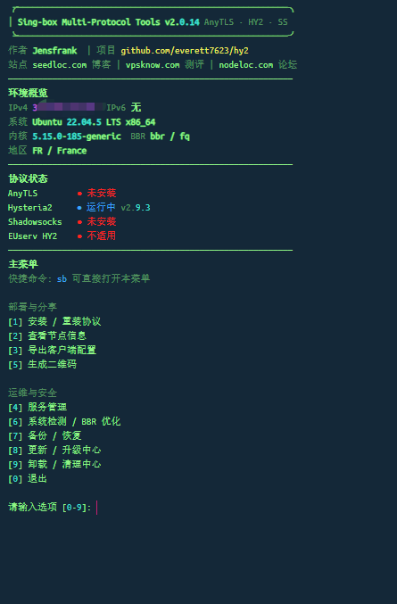
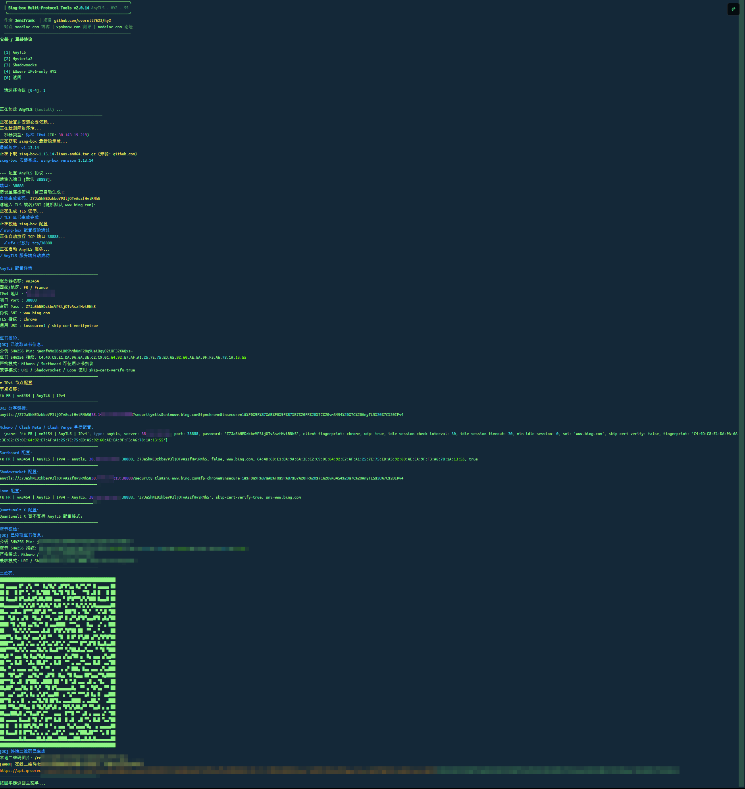
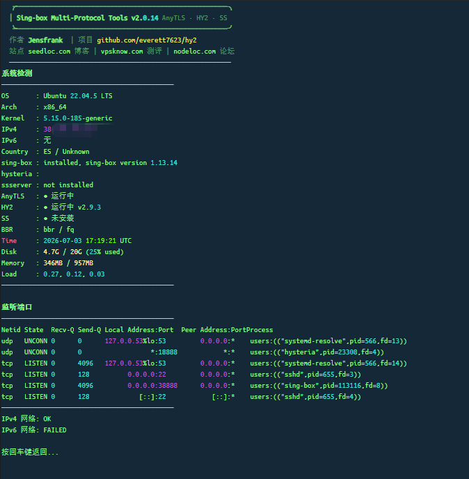
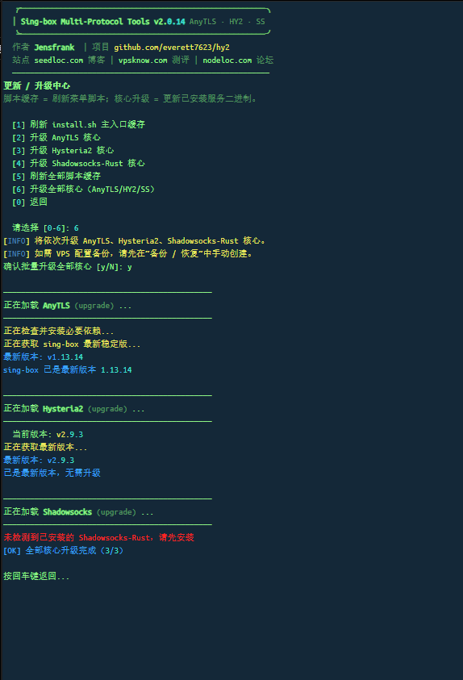
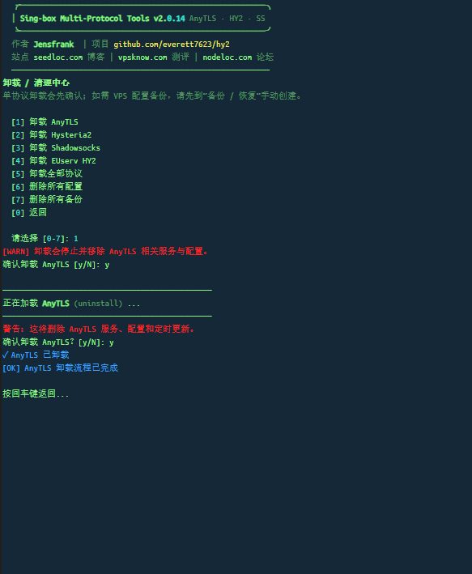

# 🚀 Sing-box Multi-Protocol Tools

> 多协议部署 · 节点导出 · 服务管理 · 系统检测 · 备份恢复
> 面向 Linux VPS 的轻量一键脚本，适合快速搭建 VLESS + REALITY + Vision、Hysteria 2、Shadowsocks、AnyTLS 与 EUserv IPv6-only 节点。


> 当前版本：v2.0.18（2026-07-14）
> 本次更新：加强配置事务、防火墙规则所有权、升级并发控制、磁盘空间预检、服务监听验证与弱网络自动重试，进一步提升小内存、NAT 和极简 VPS 的稳定性。

---

## ✨ 功能概览

| 能力 | 说明 |
| --- | --- |
| 统一入口 | 一个 `install.sh` 管理 VLESS、AnyTLS、Hysteria 2、Shadowsocks、EUserv HY2 |
| 一键部署 | 自动识别系统、架构、IPv4 / IPv6、NAT 端口、防火墙环境 |
| 节点导出 | 输出 URI、Mihomo / Clash、Surfboard、Shadowrocket、Loon、Quantumult X 与二维码 |
| 服务管理 | 查看状态、启动、停止、重启、日志、监听端口、修改配置 |
| 更新升级 | 区分脚本缓存刷新与核心二进制升级，避免误操作 |
| 手动备份 | VPS 配置备份 / 恢复由用户手动选择，不在安装时自动写入回滚包 |
| BBR 优化 | 默认只展示状态；需要时手动开启标准 `bbr + fq` |
| 低依赖 | 纯 Bash 管理逻辑，不依赖 `jq`；支持 curl / wget 下载降级，Shadowsocks 使用 musl 静态编译 |

---

## 🚀 快速开始

### 统一入口（推荐）

```bash
bash <(curl -fsSL https://raw.githubusercontent.com/everett7623/hy2/main/install.sh)
```

首次运行后会自动安装快捷命令，之后可直接输入：

```bash
sb
```

统一入口会按需下载对应协议脚本，并直接传入 `install`、`info`、`manage`、`upgrade`、`uninstall` 等动作参数。VPS 需要能访问：

```text
raw.githubusercontent.com
api.github.com
```

### GitHub raw 缓存排查（可选）

普通用户优先使用上面的简洁命令。项目刚更新后，如果 VPS 仍显示旧版本，多半是 GitHub raw 边缘缓存尚未刷新。测试或排障时可临时使用：

```bash
bash <(curl -fsSL -H 'Cache-Control: no-cache' "https://raw.githubusercontent.com/everett7623/hy2/main/install.sh?nocache=$(date +%s)")
```

---

## 🧭 协议怎么选

| 协议 | 推荐场景 | 默认端口 | 备注 |
| --- | --- | --- | --- |
| Hysteria 2 | 主力节点，大多数 IPv4 / 双栈 VPS | `18888` | UDP，高速；自签证书 + SNI 伪装，无需域名 |
| Shadowsocks | 备用节点，IPv6 / 双栈环境 | `28888` | 支持经典 AEAD 与 SS-2022；纯 IPv4 环境风险较高 |
| AnyTLS | 需要 TCP / TLS 传输的轻量节点 | `38888` | 原生 AnyTLS；支持自签、已有域名证书与 sing-box 1.14+ ACME |
| VLESS | 需要 TCP、REALITY 与 XTLS Vision 的节点 | `48888` | sing-box 原生 VLESS inbound；自动生成 UUID、REALITY 密钥与 short ID |
| EUserv HY2 | EUserv 免费 IPv6-only VPS | 自定义 | 专门处理 IPv6-only、NAT64、WARP 辅助出口 |

对应独立脚本也可以单独运行：

```bash
# Hysteria 2
bash <(curl -fsSL https://raw.githubusercontent.com/everett7623/hy2/main/hy2.sh)

# Shadowsocks
bash <(curl -fsSL https://raw.githubusercontent.com/everett7623/hy2/main/ss.sh)

# AnyTLS
bash <(curl -fsSL https://raw.githubusercontent.com/everett7623/hy2/main/anytls.sh)

# VLESS + REALITY + Vision
bash <(curl -fsSL https://raw.githubusercontent.com/everett7623/hy2/main/vless.sh)

# EUserv IPv6-only HY2
bash <(curl -fsSL https://raw.githubusercontent.com/everett7623/hy2/main/euservhy2.sh)
```

---

## 🖥️ 主菜单说明

统一入口将功能分成两类：

| 分组 | 功能 |
| --- | --- |
| 部署与分享 | 安装 / 重装、查看节点信息、导出客户端配置、生成二维码 |
| 运维与安全 | 服务管理、系统检测 / BBR 优化、备份 / 恢复、更新 / 升级、卸载 / 清理 |

注意：

- 安装、升级、卸载不会自动在 VPS 上生成回滚包。
- 如需 VPS 配置备份，请先进入“备份 / 恢复”手动创建。
- BBR 默认不启用，只展示当前状态；需要时手动开启标准 `bbr + fq`。
- `sb` 会优先拉取 GitHub `main` 的最新主入口；远程失败时会尝试使用本地缓存继续运行。

---

## 📱 客户端兼容性

| 客户端 / 平台 | Hysteria 2 | Shadowsocks | AnyTLS | VLESS REALITY |
| --- | :---: | :---: | :---: | :---: |
| Shadowrocket | ✅ | ✅ | ✅ | ✅ URI |
| Loon | ✅ | ✅ | ✅ | ✅ |
| Surfboard | ✅ | ✅ | ✅ | 暂无已确认格式 |
| Mihomo / Clash Meta | ✅ | ✅ | ✅ | ✅ |
| Stash | ✅ | ✅ | 视客户端支持 | 视客户端版本 |
| Quantumult X | 暂不推荐 | ✅ | 暂不推荐 | ✅ |
| v2rayN / NekoBox | ✅ | ✅ | 视客户端支持 | ✅ URI |

当前版本保留更常用、导入更稳定的输出格式：URI、Mihomo / Clash、Surfboard、Shadowrocket、Loon、Quantumult X 与二维码。具体格式取决于协议与客户端；VLESS REALITY 的 Surfboard 入口会明确提示改用 URI 或 Mihomo。Throne 与 Sing-box / SFA 客户端 JSON 导出已暂时移除；AnyTLS 与 VLESS 服务端仍使用 sing-box 原生入站。

---

## 🧩 支持系统

| 系统 | 版本 |
| --- | --- |
| Debian | 10 / 11 / 12+ |
| Ubuntu | 20.04 / 22.04 / 24.04+ |
| CentOS / RHEL | 7 / 8 / 9 |
| Rocky / AlmaLinux | 8 / 9 |
| Fedora | 38+ |
| Arch / Manjaro | 滚动版 |
| Alpine Linux | 3.x |

支持标准 VPS、NAT VPS、IPv6-only、双栈环境与低配机器。安装会复用已有核心依赖，大文件下载、解压和事务备份优先使用磁盘型 `/var/tmp`，减少小内存机器的 tmpfs 占用。EUserv 专用脚本优先适配 Debian IPv6-only 环境。

---

## 🛠️ 常见问题

### 运行后无法输入

请使用文档中的 `bash <(curl ...)`，不要使用 `curl ... | sh`。交互式菜单需要可用的 `/dev/tty`。

### GitHub 下载失败

先检查 VPS 网络、DNS 和系统时间：

```bash
curl -I https://raw.githubusercontent.com
curl -I https://api.github.com
date
```

如果刚发布后仍显示旧版本，请使用上文的 `nocache` 命令排查 GitHub raw 缓存。

### 服务已安装但无法连接

优先检查：

1. 云服务商安全组是否放行端口。
2. 脚本菜单中的服务状态和日志。
3. NAT VPS 的外网端口是否映射到脚本配置端口。
4. Hysteria 2 是否放行 UDP 端口。
5. SS-2022 客户端和服务端时间是否准确。
6. VLESS 客户端是否完整填写 UUID、SNI、REALITY 公钥、short ID 与 `xtls-rprx-vision`。
7. VLESS 配置的 REALITY 目标域名和端口是否能从 VPS 正常访问。

### 本地修改为什么没生效

远程入口默认下载 GitHub `main` 分支脚本，不会调用当前目录里的本地文件。开发调试请直接运行本地脚本，例如：

```bash
bash install.sh
bash hy2.sh
bash vless.sh
```

---

## 📸 运行截图

截图统一放在 `docs/assets/screenshots/`。后续如需替换，保持文件名不变即可。

### 首页总览



### AnyTLS 安装与节点导出

AnyTLS 安装时可选择三种证书模式：默认自签证书、已有域名证书文件，或 sing-box 1.14+ ACME Certificate Provider。已有证书模式会校验证书有效期、域名 SAN、证书与私钥是否匹配，并要求私钥由 root 所有且禁止 group/other 权限；ACME 模式使用新的 `certificate_provider` 格式，不生成已弃用的 `tls.acme`。自签模式的客户端输出保留兼容性跳过验证，域名证书和 ACME 模式使用系统信任链严格校验。ACME 安装会按所有权记录放行 TCP 80/443，但云安全组、域名解析和 NAT 转发仍需管理员配置。



### 系统检测



### 更新 / 升级中心



### 卸载 / 清理中心



---

## 📂 项目结构

| 文件 | 用途 |
| --- | --- |
| `install.sh` | 统一入口，负责菜单、调度、缓存和跨协议管理 |
| `hy2.sh` | Hysteria 2 安装、管理、升级、卸载与导出 |
| `ss.sh` | Shadowsocks-Rust 安装、管理、升级、卸载与导出 |
| `anytls.sh` | AnyTLS / sing-box 原生入站安装与管理 |
| `vless.sh` | VLESS + REALITY + XTLS Vision / sing-box 原生入站安装与管理 |
| `euservhy2.sh` | EUserv IPv6-only 专用 Hysteria 2 脚本 |
| `tests/validate_scripts.sh` | 静态验证、版本、换行、菜单和兼容性检查 |
| `tests/validate_anytls.sh` | AnyTLS 行为验证 |
| `tests/validate_vless.sh` | VLESS、REALITY 配置与共享核心行为验证 |
| `docs/` | 架构、测试、发布和维护说明 |
| `CHANGELOG.md` | 版本变更记录 |

---

## 📚 开发文档

- [CONTRIBUTING.md](CONTRIBUTING.md)
- [AGENTS.md](AGENTS.md)
- [CLAUDE.md](CLAUDE.md)
- [架构说明](docs/ARCHITECTURE.md)
- [测试指南](docs/TESTING.md)
- [发布流程](docs/RELEASE.md)
- [维护说明](docs/MAINTENANCE.md)

---

## 🔗 关于作者

| | |
| --- | --- |
| Author | everettlabs |
| GitHub | [everett7623/hy2](https://github.com/everett7623/hy2) |
| Blog | [seedloc.com](https://seedloc.com) |
| Review | [vpsknow.com](https://vpsknow.com) |
| Forum | [nodeloc.com](https://nodeloc.com) |

---

## ⚠️ 免责声明

- 本项目仅供学习、技术研究和网络协议交流使用。
- 请勿将本项目用于任何违反当地法律法规的用途。
- 使用本项目产生的任何后果由使用者自行承担。

如果脚本对你有帮助，欢迎点个 Star 支持一下。
